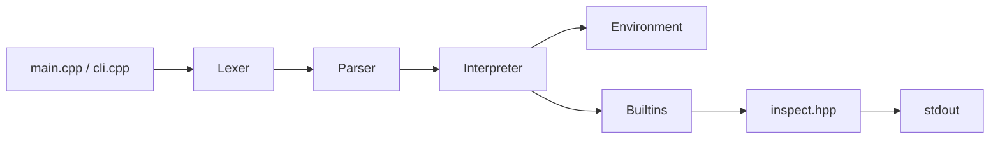

# jsling C++ — Node.js-Like JavaScript Runtime

> Port the Python **jsling** interpreter to **C++** with **Node.js-compatible CLI, semantics, and output formatting**.

This document is the complete blueprint for building `COMPILER_CPP/` — a from-scratch JavaScript interpreter in C++ that behaves like Node.js for the hackathon feature set.

---

## Table of Contents

1. [Goals](#1-goals)
2. [Node.js Parity Checklist](#2-nodejs-parity-checklist)
3. [Tech Stack](#3-tech-stack)
4. [Project Structure](#4-project-structure)
5. [Architecture](#5-architecture)
6. [Python → C++ Module Mapping](#6-python--c-module-mapping)
7. [Core C++ Design](#7-core-c-design)
8. [Source File Specifications](#8-source-file-specifications)
9. [Build & Run](#9-build--run)
10. [Implementation Phases](#10-implementation-phases)
11. [Testing Strategy](#11-testing-strategy)
12. [Node.js Output Formatting Rules](#12-nodejs-output-formatting-rules)
13. [Common Pitfalls](#13-common-pitfalls)

---

## 1. Goals

| Goal | Detail |
|------|--------|
| **Language** | C++17 (minimum) — use `std::variant`, `std::optional`, `std::string_view` |
| **No JS engine** | Do not embed V8, QuickJS, or any existing JS runtime |
| **Node.js-like CLI** | `jsling script.js`, `jsling -e "code"`, `jsling` (REPL) |
| **Node.js-like output** | `console.log` formatting must match Node for arrays, objects, strings, `null`, `undefined` |
| **Feature parity** | Match all features in `COMPILER/` Python version + hackathon test cases |
| **Zero runtime deps** | Standard library + OS only (optional `readline` for REPL on Unix) |
| **Hackathon compliant** | C++ is an allowed submission language |

---

## 2. Node.js Parity Checklist

Your C++ runtime must match Node.js behavior for these areas:

### CLI (identical to Node)

```bash
jsling script.js              # Run a file          (like: node script.js)
jsling -e "console.log(1);"   # Eval inline         (like: node -e "...")
jsling                        # Interactive REPL      (like: node)
jsling --version              # Print version
jsling --help                 # Print usage
```

### Semantics (must match Node)

| Area | Node.js behavior to replicate |
|------|-------------------------------|
| `console.log(a, b, c)` | Space-separated args, trailing newline |
| Array printing | `[ 1, 2, 3 ]` with spaces |
| Object printing | `{ key: value }` with spaces |
| Nested strings in arrays | Quoted: `[ 1, 'two', true ]` |
| `null` vs `undefined` | Distinct values, correct display |
| `==` vs `===` | Loose vs strict equality with coercion |
| `+` operator | String concat if either operand is string |
| Truthiness | `0`, `""`, `null`, `undefined`, `NaN`, `false` are falsy |
| `typeof null` | Returns `"object"` |
| `typeof undefined` | Returns `"undefined"` |
| Integer display | `2.0` prints as `2`, not `2.0` |
| Method chaining | `str.split("").reverse().join("")` works |
| Closures | Lexical scoping, not dynamic |
| `let`/`const` | Block-scoped; `var` is function-scoped |

### Exit codes

| Situation | Exit code |
|-----------|-----------|
| Success | `0` |
| Syntax error | `1` |
| Runtime error | `1` |
| File not found | `1` |

---

## 3. Tech Stack

| Component | Choice | Reason |
|-----------|--------|--------|
| **Language** | C++17 | `std::variant`, structured bindings, no heavy deps |
| **Build** | CMake 3.16+ | Cross-platform, standard for C++ |
| **AST memory** | `std::unique_ptr<ASTNode>` | Clear ownership, no leaks |
| **JS values** | `JSValue` tagged union / `std::variant` | Type-safe runtime values |
| **Environment** | `shared_ptr<Environment>` | Closures share parent scopes |
| **Numbers** | `double` | Matches JS IEEE-754 doubles |
| **Strings** | `std::string` | UTF-8 byte strings (same as Node for ASCII) |
| **REPL** | `std::getline` (+ optional GNU readline) | Simple, portable |
| **Tests** | Shell script + diff against expected output | Same `.js` files as Python version |

---

## 4. Project Structure

```
hackthon/
├── COMPILER/              # Existing Python implementation (reference)
├── COMPILER_CPP/          # ★ New C++ implementation
│   ├── CMakeLists.txt
│   ├── README.md
│   ├── include/jsling/
│   │   ├── token.hpp           # TokenType enum, Token struct
│   │   ├── lexer.hpp           # Lexer class
│   │   ├── ast.hpp             # All AST node types
│   │   ├── parser.hpp          # Parser class
│   │   ├── environment.hpp     # Scope chain
│   │   ├── value.hpp           # JSValue, JSNull, JSUndefined
│   │   ├── builtins.hpp        # console, Math, Date, Object
│   │   ├── interpreter.hpp     # Tree-walking evaluator
│   │   ├── errors.hpp          # JSError, ReturnSignal, etc.
│   │   ├── inspect.hpp         # Node-like value formatting
│   │   └── cli.hpp             # REPL, file, -e modes
│   ├── src/
│   │   ├── main.cpp            # Entry point
│   │   ├── token.cpp
│   │   ├── lexer.cpp
│   │   ├── ast.cpp
│   │   ├── parser.cpp
│   │   ├── environment.cpp
│   │   ├── value.cpp
│   │   ├── builtins.cpp
│   │   ├── interpreter.cpp
│   │   ├── errors.cpp
│   │   ├── inspect.cpp
│   │   └── cli.cpp
│   ├── tests/                  # Symlink or copy from COMPILER/tests/
│   └── scripts/
│       ├── build.sh
│       └── run_tests.sh
└── CPP_IMPLEMENTATION.md       # This file
```

---

## 5. Architecture

Same pipeline as the Python version:

```
JavaScript Source
      ↓
  Lexer (token.hpp / lexer.cpp)
      ↓
  Token stream
      ↓
  Parser (ast.hpp / parser.cpp)     — recursive descent + precedence climbing
      ↓
  AST (std::unique_ptr<Program>)
      ↓
  Interpreter (interpreter.cpp)     — tree-walking evaluator
      ↓
  Environment chain + JSValue
      ↓
  stdout (console.log via inspect.hpp)
```



---

## 6. Python → C++ Module Mapping

| Python (`COMPILER/`) | C++ (`COMPILER_CPP/`) | Notes |
|----------------------|------------------------|-------|
| `lexer.py` | `lexer.cpp` + `token.hpp` | Port `TokenType` enum and `Lexer` class |
| `parser.py` | `parser.cpp` + `ast.hpp` | ~40 AST node structs instead of classes |
| `interpreter.py` | `interpreter.cpp` | `eval()` dispatch via `std::visit` or virtual |
| `environment.py` | `environment.cpp` | `shared_ptr` parent chain |
| `js_builtins.py` | `builtins.cpp` + `value.hpp` | `JSValue`, native functions |
| `errors.py` | `errors.cpp` | C++ exceptions for control flow |
| `main.py` + `cli.py` | `main.cpp` + `cli.cpp` | Full Node-like CLI |
| `format_js_value()` | `inspect.cpp` | **Critical for Node parity** |

---

## 7. Core C++ Design

### 7.1 JSValue — Runtime Value Type

```cpp
// include/jsling/value.hpp
#pragma once
#include <memory>
#include <string>
#include <vector>
#include <unordered_map>
#include <functional>
#include <variant>

namespace jsling {

struct JSNull {};
struct JSUndefined {};
struct JSObject;
struct JSFunction;
struct JSNativeFunction;

using JSArray = std::vector<JSValue>;
using JSObjectPtr = std::shared_ptr<JSObject>;
using JSFunctionPtr = std::shared_ptr<JSFunction>;
using JSNativeFn = std::function<JSValue(const std::vector<JSValue>&)>;

struct JSValue {
    std::variant<
        std::monostate,   // uninitialized
        JSNull,
        JSUndefined,
        bool,
        double,
        std::string,
        JSArray,
        JSObjectPtr,
        JSFunctionPtr,
        std::shared_ptr<JSNativeFunction>
    > data;

    // Constructors, type checks, toString for display
    static JSValue makeNull();
    static JSValue makeUndefined();
    static JSValue makeNumber(double n);
    static JSValue makeString(std::string s);
    static JSValue makeBool(bool b);

    bool isNull() const;
    bool isUndefined() const;
    bool isNumber() const;
    bool isString() const;
    bool isArray() const;
    bool isObject() const;
    bool isFunction() const;
    bool isTruthy() const;

    double asNumber() const;
    const std::string& asString() const;
    JSArray& asArray();
    JSObjectPtr asObject() const;
};

} // namespace jsling
```

### 7.2 AST Nodes

Use a base struct + `enum class NodeKind` + `std::unique_ptr` children (or `std::variant` for all node types):

```cpp
// include/jsling/ast.hpp
#pragma once
#include <memory>
#include <string>
#include <vector>
#include "value.hpp"

namespace jsling {

enum class NodeKind {
    Program, Block, VarDecl, FunctionDecl, Return, If, For, ForOf, ForIn,
    While, DoWhile, Switch, Break, Continue, ExprStmt,
    Binary, Unary, Update, Assign, Logical, Call, Member, New,
    Array, Object, ArrowFn, Conditional, Template, Spread,
    Identifier, Literal, ArrayPattern, ObjectPattern
};

struct ASTNode {
    NodeKind kind;
    virtual ~ASTNode() = default;
};

struct Program : ASTNode {
    std::vector<std::unique_ptr<ASTNode>> body;
};

struct BinaryExpr : ASTNode {
    std::string op;  // "+", "===", "&&", etc.
    std::unique_ptr<ASTNode> left;
    std::unique_ptr<ASTNode> right;
};

// ... mirror all nodes from COMPILER/parser.py

} // namespace jsling
```

**Alternative (recommended for maintainability):** use `std::variant<Program, BinaryExpr, ...>` with a type alias `using ASTPtr = std::variant<...>` and recursive `std::unique_ptr` wrappers.

### 7.3 Environment (Scope Chain)

```cpp
// include/jsling/environment.hpp
#pragma once
#include <unordered_map>
#include <memory>
#include "value.hpp"
#include "errors.hpp"

namespace jsling {

class Environment : public std::enable_shared_from_this<Environment> {
public:
    explicit Environment(std::shared_ptr<Environment> parent = nullptr);

    void define(const std::string& name, JSValue value);
    JSValue get(const std::string& name) const;
    void set(const std::string& name, JSValue value);
    void setLocal(const std::string& name, JSValue value);
    bool has(const std::string& name) const;

private:
    std::shared_ptr<Environment> parent_;
    std::unordered_map<std::string, JSValue> vars_;
};

} // namespace jsling
```

### 7.4 Control-Flow Exceptions

```cpp
// include/jsling/errors.hpp
#pragma once
#include "value.hpp"
#include <stdexcept>
#include <string>

namespace jsling {

class JSError : public std::runtime_error {
public:
    using std::runtime_error::runtime_error;
};

class SyntaxError : public JSError { using JSError::JSError; };
class ReferenceError : public JSError { using JSError::JSError; };
class TypeError : public JSError { using JSError::JSError; };

struct ReturnSignal {
    JSValue value;
    explicit ReturnSignal(JSValue v) : value(std::move(v)) {}
};

struct BreakSignal {};
struct ContinueSignal {};

} // namespace jsling
```

### 7.5 Interpreter Dispatch

```cpp
// include/jsling/interpreter.hpp
#pragma once
#include "ast.hpp"
#include "environment.hpp"
#include "builtins.hpp"

namespace jsling {

class Interpreter {
public:
    Interpreter();
    void interpret(const Program& program);
    JSValue eval(const ASTNode& node, std::shared_ptr<Environment> env);
    JSValue callFunction(const JSFunctionPtr& fn,
                         const std::vector<JSValue>& args,
                         JSValue thisVal = JSValue::makeUndefined());
    void bindPattern(const ASTNode& pattern, JSValue value,
                     std::shared_ptr<Environment> env);

private:
    std::shared_ptr<Environment> globalEnv_;
    void setupGlobals();
    JSValue evalBinary(const BinaryExpr& node, std::shared_ptr<Environment> env);
    JSValue evalCall(const CallExpr& node, std::shared_ptr<Environment> env);
    JSValue evalMember(const MemberExpr& node, std::shared_ptr<Environment> env);
    // ... one eval method per node type
};

} // namespace jsling
```

### 7.6 Node-Like Inspect (console.log formatting)

```cpp
// include/jsling/inspect.hpp
#pragma once
#include "value.hpp"
#include <string>

namespace jsling {

// Top-level console.log argument formatting
std::string toDisplayString(const JSValue& value);

// Recursive inspect for nested arrays/objects (Node util.inspect style)
std::string inspect(const JSValue& value, int depth = 0);

} // namespace jsling
```

**Rules (must match Node):**

| Value | Top-level `console.log` | Nested in array/object |
|-------|-------------------------|------------------------|
| `42` | `42` | `42` |
| `3.14` | `3.14` | `3.14` |
| `"hello"` | `hello` (no quotes) | `'hello'` (single quotes) |
| `true` | `true` | `true` |
| `null` | `null` | `null` |
| `undefined` | `undefined` | `undefined` |
| `[1,2,3]` | `[ 1, 2, 3 ]` | `[ 1, 2, 3 ]` |
| `{a:1}` | `{ a: 1 }` | `{ a: 1 }` |

---

## 8. Source File Specifications

### 8.1 `src/main.cpp` — Entry Point

```cpp
#include "jsling/cli.hpp"
#include <iostream>

int main(int argc, char* argv[]) {
    try {
        return jsling::runCli(argc, argv);
    } catch (const jsling::JSError& e) {
        std::cerr << e.what() << '\n';
        return 1;
    } catch (const std::exception& e) {
        std::cerr << "Internal error: " << e.what() << '\n';
        return 1;
    }
}
```

### 8.2 `src/cli.cpp` — Node-Like CLI

```cpp
// Behavior:
// argc == 1           → REPL
// argv[1] == "-e"     → eval argv[2]
// argv[1] == "--version" → print "jsling v1.0.0"
// argv[1] == "--help"    → print usage
// else                → run file argv[1]

int runCli(int argc, char* argv[]) {
    if (argc == 1) return runRepl();
    if (std::string(argv[1]) == "-e") {
        if (argc < 3) { printUsage(); return 1; }
        return runSource(argv[2]);
    }
    if (std::string(argv[1]) == "--version") {
        std::cout << "jsling v1.0.0\n";
        return 0;
    }
    if (std::string(argv[1]) == "--help") {
        printUsage();
        return 0;
    }
    return runFile(argv[1]);
}

int runSource(const std::string& source) {
    Lexer lexer(source);
    auto tokens = lexer.tokenize();
    Parser parser(tokens);
    auto ast = parser.parse();
    Interpreter interp;
    interp.interpret(*ast);
    return 0;
}

int runRepl() {
    std::cout << "jsling v1.0.0 - JavaScript Runtime (REPL)\n";
    std::cout << "Type \"exit()\" or press Ctrl+D to quit\n\n";
    Interpreter interp;  // persistent global env across lines
    std::string line;
    while (true) {
        std::cout << ">>> ";
        if (!std::getline(std::cin, line)) { std::cout << '\n'; break; }
        if (line == "exit()" || line == "quit()") break;
        if (line.empty()) continue;
        try {
            runSource(line);  // or reuse interp for persistent state
        } catch (const JSError& e) {
            std::cerr << e.what() << '\n';
        }
    }
    return 0;
}
```

### 8.3 `src/lexer.cpp` — Port from Python

Direct port of `COMPILER/lexer.py`:

1. Define `enum class TokenType` with all types from Python `TokenType`
2. `struct Token { TokenType type; std::string lexeme; int line; }`
3. `Lexer` class: `explicit Lexer(std::string source)`, `std::vector<Token> tokenize()`
4. Handle: keywords, numbers, strings (`'`, `"`, `` ` ``), template literals, comments, operators

### 8.4 `src/parser.cpp` — Port from Python

Direct port of `COMPILER/parser.py`:

1. Recursive descent for statements
2. Precedence climbing for expressions (15 levels — same method names as Python):
   - `parseAssignmentExpression` → `parseConditionalExpression` → ... → `parsePrimaryExpression`
3. Postfix loop for `.`, `[...]`, `(...)` chaining
4. All ~40 AST node types from Python

### 8.5 `src/interpreter.cpp` — Port from Python

Direct port of `COMPILER/interpreter.py`:

1. `setupGlobals()` — register `console`, `Math`, `Date`, `Object`, globals
2. `eval()` — big switch on `node.kind` or visitor pattern
3. `bindPattern()` — destructuring for decls, params, for-of
4. Type coercion: `toNumber()`, `toString()`, `toBoolean()`, `jsAdd()`, `jsEquals()`, `jsStrictEquals()`
5. Method dispatch table by runtime type (string / number / array / object)

### 8.6 `src/builtins.cpp` — Port from Python

Port `COMPILER/js_builtins.py`:

| Built-in | C++ implementation |
|----------|-------------------|
| `console.log` | Join `toDisplayString(arg)` with space, print newline |
| `Math.*` | Wrap `<cmath>` functions |
| `Date` | Wrap `<chrono>` / `<ctime>` |
| `Object.keys/values/entries` | Native functions on `JSObject` |
| Array methods | Static functions in `ArrayMethods` namespace |
| String methods | Static functions in `StringMethods` namespace |
| Number methods | `toFixed`, `toString(radix)` in `NumberMethods` namespace |
| Globals | `parseInt`, `parseFloat`, `Number`, `String`, `Boolean`, `isNaN`, `isFinite` |

### 8.7 `CMakeLists.txt`

```cmake
cmake_minimum_required(VERSION 3.16)
project(jsling VERSION 1.0.0 LANGUAGES CXX)

set(CMAKE_CXX_STANDARD 17)
set(CMAKE_CXX_STANDARD_REQUIRED ON)
set(CMAKE_CXX_EXTENSIONS OFF)

add_executable(jsling
    src/main.cpp
    src/token.cpp
    src/lexer.cpp
    src/ast.cpp
    src/parser.cpp
    src/environment.cpp
    src/value.cpp
    src/builtins.cpp
    src/interpreter.cpp
    src/errors.cpp
    src/inspect.cpp
    src/cli.cpp
)

target_include_directories(jsling PRIVATE include)

# Warnings
if(MSVC)
    target_compile_options(jsling PRIVATE /W4)
else()
    target_compile_options(jsling PRIVATE -Wall -Wextra -Wpedantic)
endif()

# Math library on some platforms
target_link_libraries(jsling PRIVATE m)

install(TARGETS jsling RUNTIME DESTINATION bin)
```

---

## 9. Build & Run

```bash
cd COMPILER_CPP

# Build
mkdir -p build && cd build
cmake ..
cmake --build . -j$(nproc)

# Run (Node-like)
./jsling ../tests/level1_basics/tc1_oddeven.js    # → 7 is Odd
./jsling -e "console.log(1 + 1);"                 # → 2
./jsling                                           # REPL

# Install system-wide
sudo cmake --install .

# Run all tests (same .js files as Python version)
cd ..
./scripts/run_tests.sh
```

### `scripts/run_tests.sh`

```bash
#!/usr/bin/env bash
set -euo pipefail
BIN="${BIN:-./build/jsling}"
PASS=0; FAIL=0

declare -A EXPECTED=(
  ["level1_basics/tc1_oddeven.js"]="7 is Odd"
  ["level1_basics/tc2_triangle.js"]=$'*\\n**\\n***\\n****\\n*****'
  # ... copy all entries from COMPILER/tests/test_jsling.py
)

for js in tests/level*/*.js; do
  rel="${js#tests/}"
  out=$("$BIN" "$js" 2>/dev/null || true)
  exp="${EXPECTED[$rel]:-}"
  if [ -n "$exp" ] && [ "$(echo "$out" | tr -d '\r')" = "$exp" ]; then
    echo "PASS $rel"; ((PASS++))
  elif [ -n "$exp" ]; then
    echo "FAIL $rel"; echo "  expected: $exp"; echo "  got:      $out"; ((FAIL++))
  else
    echo "RUN  $rel (no expected output)"
  fi
done
echo "Results: $PASS passed, $FAIL failed"
```

---

## 10. Implementation Phases

Port in this order — each phase unlocks the next test tier.

### Phase 1 — Scaffold & CLI (Day 1, ~2 hours)
- [ ] CMake project, `main.cpp`, `cli.cpp`
- [ ] `--version`, `--help`, file runner (empty interpreter)
- [ ] REPL loop

### Phase 2 — Lexer (Day 1, ~3 hours)
- [ ] Port `TokenType` and `Lexer` from `lexer.py`
- [ ] Unit test: tokenize TC1 source, dump tokens

### Phase 3 — Parser basics (Day 1–2, ~6 hours)
- [ ] Literals, identifiers, binary/unary expressions
- [ ] Variable declarations, if/else, blocks
- [ ] **Goal: parse TC1**

### Phase 4 — Interpreter basics (Day 2, ~4 hours)
- [ ] `Environment`, `JSValue`, coercion helpers
- [ ] Expression evaluation, if/else, console.log
- [ ] **Goal: pass TC1**

### Phase 5 — Loops & functions (Day 2–3, ~6 hours)
- [ ] for, while, do-while, return, break, continue
- [ ] Function declarations, closures
- [ ] **Goal: pass TC2, TC3**

### Phase 6 — Arrays & strings (Day 3, ~6 hours)
- [ ] Array/string literals, member access, method dispatch
- [ ] Spread operator, array methods, string methods
- [ ] **Goal: pass TC4, TC5**

### Phase 7 — Advanced JS (Day 3–4, ~8 hours)
- [ ] Arrow functions, template literals, destructuring
- [ ] for-of, for-in, switch, Math, Date, Object.*
- [ ] **Goal: pass all 16 extended tests**

### Phase 8 — Node parity polish (Day 4, ~4 hours)
- [ ] `inspect.cpp` — exact Node formatting
- [ ] Edge cases: `typeof`, coercion, chained calls, `new Date().getFullYear()`
- [ ] Performance: avoid re-lexing template literals at runtime

---

## 11. Testing Strategy

Reuse the **exact same** `.js` test files from `COMPILER/tests/`:

```bash
# Copy or symlink tests
ln -s ../COMPILER/tests COMPILER_CPP/tests
```

| Tier | Directory | Tests |
|------|-----------|-------|
| Level 1 | `level1_basics/` | TC1, TC2, conditionals, basic values |
| Level 2 | `level2_data_structures/` | TC3–TC5, arrays, strings, objects |
| Level 3 | `level3_advanced/` | closures, destructuring, templates, for-of/in |

**Validation:** stdout must match `COMPILER/tests/test_jsling.py` `EXPECTED_OUTPUTS` **byte-for-byte** (including newlines).

**Cross-check with Node:**
```bash
node tests/level1_basics/tc1_oddeven.js
./build/jsling tests/level1_basics/tc1_oddeven.js
# Outputs must be identical
```

---

## 12. Node.js Output Formatting Rules

Implement in `inspect.cpp`. Reference: Node's `util.inspect` behavior.

```cpp
std::string inspect(const JSValue& v, int depth) {
    if (v.isNull()) return "null";
    if (v.isUndefined()) return "undefined";
    if (v.isBool()) return v.asBool() ? "true" : "false";
    if (v.isNumber()) return formatNumber(v.asNumber());  // 2.0 → "2"
    if (v.isString()) return "'" + escapeString(v.asString()) + "'";
    if (v.isArray()) {
        std::string s = "[ ";
        for (size_t i = 0; i < arr.size(); ++i) {
            if (i > 0) s += ", ";
            s += inspect(arr[i], depth + 1);
        }
        return s + " ]";
    }
    if (v.isObject()) { /* { key: value, ... } */ }
    if (v.isFunction()) return "[Function]";
    return "undefined";
}

std::string toDisplayString(const JSValue& v) {
    // Top-level: strings unquoted, everything else via inspect
    if (v.isString()) return v.asString();
    return inspect(v, 0);
}
```

---

## 13. Common Pitfalls

| Pitfall | Fix |
|---------|-----|
| Using `nullptr` for both `null` and `undefined` | Use distinct `JSNull` and `JSUndefined` types |
| Python truthiness (`""` is falsy in Python too, but `0.0` differs) | Implement JS truthiness explicitly |
| Forgetting string coercion in `+` | If either operand is string after `ToPrimitive`, concatenate |
| `2.0` printing as `2.0` | Check `std::floor(n) == n` → print as integer |
| Closures capturing calling env | Capture **defining** env in `JSFunction` |
| Re-lexing `${expr}` at runtime | Parse template expressions at parse time, store AST |
| Method dispatch only for arrays/strings | Add dispatch tables for **number**, **object**, **function** too |
| C++ integer division in `/` | Always use `double` division |
| Missing `\n` after `console.log` | Always print trailing newline |
| Off-by-one in triangle TC2 | Match exact star count per row |

---

## Quick Reference: File Port Order

```
1. token.hpp / token.cpp       ← lexer.py TokenType
2. lexer.hpp / lexer.cpp       ← lexer.py Lexer
3. ast.hpp / ast.cpp           ← parser.py ASTNode classes
4. parser.hpp / parser.cpp     ← parser.py Parser
5. errors.hpp / errors.cpp     ← errors.py
6. value.hpp / value.cpp       ← js_builtins.py JSValue types
7. environment.hpp / .cpp      ← environment.py
8. inspect.hpp / inspect.cpp   ← js_builtins.py format_js_value (NEW — Node parity)
9. builtins.hpp / builtins.cpp ← js_builtins.py
10. interpreter.hpp / .cpp     ← interpreter.py
11. cli.hpp / cli.cpp          ← cli.py
12. main.cpp                   ← main.py
```

---

## 14. Minimum Built-in Surface (Required Before Anything Else)

Before chasing exotic hidden-test features, the interpreter must reliably run
**any full `.js` file** end-to-end and get these primitives right — they
underpin almost every test:

| Category | Minimum required |
|---|---|
| **`null` / `undefined`** | Two distinct singleton `JSValue`s. `typeof null === "object"`, `typeof undefined === "undefined"`. Both print correctly bare (`undefined`/`null`) and nested in arrays/objects. Comparisons: `null == undefined` → `true`, `null === undefined` → `false`. |
| **Numbers** | `double` storage. Integer-valued doubles print without `.0` (`2`, not `2.0`). `NaN`, `Infinity`, `-Infinity` as special cases of `double` with correct `typeof` (`"number"`) and printing (`NaN`, `Infinity`). Methods: `.toFixed(n)`, `.toString(radix)`, `.toPrecision(n)`. |
| **Strings** | Full literal support (`'`, `"`, `` ` ``). **Template literals (`` `...${expr}...` ``) must actually interpolate** — parsed into a `TemplateLiteral` AST node at parse time (list of static string chunks + list of expression ASTs), evaluated and concatenated at runtime. No re-lexing at eval time. All listed string methods (`replace, replaceAll, substring, slice, split, trim, toUpperCase, toLowerCase, includes, startsWith, endsWith, indexOf, charAt, concat, repeat, padStart, padEnd, length`). |
| **`Date`** | `new Date()` (current time), `new Date(ms)`, `new Date(year, month, day, ...)`. Methods: `getFullYear, getMonth, getDate, getDay, getHours, getMinutes, getSeconds, getMilliseconds, getTime, toISOString, toString`. `Date.now()`. Built on `<chrono>`. **Must support method chaining off the constructor result** — `new Date().getFullYear()` is a `NewExpression` followed by postfix `.method()`, and parser postfix-chain logic must run on `NewExpression` results too. |
| **`Math`** | Full object: `floor, ceil, round, trunc, abs, max, min, pow, sqrt, cbrt, sign, random, PI, E, LN2, LN10, log, log2, log10, exp, hypot`. `Math.random()` returns `[0,1)` via `<random>`. |
| **Full-file execution** | The interpreter must run a `.js` file containing **any mixture** of the above top to bottom — multiple statements, multiple function/variable declarations, nested scopes — not just single-expression snippets. Verify with a "kitchen sink" test file exercising every category above in one script. |

### 14.1 "Modules" — what this hackathon actually needs

True ESM/CommonJS module resolution (`import`/`require` across files) is
**out of scope** for the hackathon spec and not worth building — hidden
tests are single-file `.js` snippets. However, "understand modules" can mean
two lighter-weight, high-value things:

1. **Parse and not crash on `import`/`export`/`require` syntax** if it
   appears — even if you only support the **single-file case** by treating
   `export` as a no-op declaration modifier and erroring clearly (not
   crashing with an internal error) on `import`/`require` of external files.
   This avoids a hard parse failure if a hidden test happens to include a
   stray `module.exports` or `export default` line.
2. **Multi-statement, multi-function "file-level" execution** — i.e. the
   `Program` node must support top-level `function` declarations being
   hoisted/available to code that runs before their textual position (JS
   function declarations are hoisted), and top-level `let`/`const`/`var`
   coexisting with multiple function declarations, classes (if in scope),
   and statements that reference each other. This is the realistic
   "multi-part file" scenario hidden tests will use, not real module loading.

If `import`/`export`/`require` show up at all in hidden tests, the **safe
minimum** is: lexer/parser recognize the tokens and either (a) ignore
`export` as a modifier on the following declaration, or (b) throw a clear,
catchable `SyntaxError`/`ReferenceError` rather than segfaulting or an
unhandled C++ exception. Decide based on time budget — (a) is more robust if
cheap to add.

---

## 15. Comprehensive Automated Test Suite

Replace the ad-hoc `EXPECTED` bash associative array with a structured,
expandable test harness. Two complementary layers:

### 15.1 Golden-file tests (primary)

```
tests/
├── level1_basics/
│   ├── tc1_oddeven.js / .expected
│   ├── tc2_triangle.js / .expected
│   ├── conditionals.js / .expected
│   └── ...
├── level2_data_structures/
│   ├── tc3_armstrong.js / .expected
│   ├── tc4_array_reverse.js / .expected
│   ├── tc5_palindrome.js / .expected
│   ├── arrays_methods.js / .expected      # push/pop/shift/unshift/slice/splice/concat/includes/indexOf/sort/reverse/join
│   ├── strings_methods.js / .expected     # replace/replaceAll/substring/slice/split/trim/case/includes/startsWith/endsWith/indexOf
│   ├── objects_basic.js / .expected       # literals, dot/bracket access, nested objects
│   └── ...
├── level3_advanced/
│   ├── closures.js / .expected
│   ├── callbacks.js / .expected           # map/filter/reduce/find/some/every with custom callbacks
│   ├── arrow_functions.js / .expected
│   ├── template_literals.js / .expected   # nested ${}, multiple interpolations, expressions inside
│   ├── destructuring_array.js / .expected # incl. holes, rest
│   ├── destructuring_object.js / .expected# incl. rename, default, rest
│   ├── spread_rest.js / .expected         # array/object spread, rest params, spread in calls
│   ├── for_of_in.js / .expected
│   ├── switch_statement.js / .expected
│   ├── do_while.js / .expected
│   ├── ternary.js / .expected
│   ├── type_coercion.js / .expected       # "5"+1, "5"-1, ==, ===, truthiness
│   └── typeof_all_types.js / .expected
├── level4_builtins/
│   ├── math_object.js / .expected         # all Math.* except random (non-deterministic)
│   ├── date_object.js / .expected         # use fixed-timestamp Date(ms) for determinism
│   ├── number_methods.js / .expected      # toFixed, toString(radix), toPrecision
│   ├── string_template_full.js / .expected
│   └── object_keys_values_entries.js / .expected
├── level5_integration/
│   ├── kitchen_sink.js / .expected        # one file using every category in 14
│   └── full_program_multi_function.js / .expected  # multiple top-level functions calling each other
└── errors/
    ├── undefined_variable.js / .expected_error
    ├── call_non_function.js / .expected_error
    ├── syntax_error_unclosed.js / .expected_error
    └── ...
```

**Rules:**
- Every `.js` file has a matching `.expected` (stdout, byte-for-byte incl.
  trailing newline) or `.expected_error` (non-zero exit + expected stderr
  substring).
- `Math.random()` and `Date.now()` / `new Date()` (no args) are
  non-deterministic — test files using them should either (a) only check
  `typeof` / range / structure rather than exact value, or (b) use
  fixed-timestamp `new Date(ms)` for exact-output tests.
- Cross-check every `.expected` file against real `node script.js` output
  where Node is available, to guarantee Node parity rather than
  "whatever our interpreter currently does."

### 15.2 `scripts/run_tests.sh` — auto-discovering runner

Rewrite to **auto-discover** test pairs instead of hardcoding an associative
array — this is the key change so adding a new test = adding two files, no
script edits:

```bash
#!/usr/bin/env bash
set -uo pipefail
BIN="${BIN:-./build/jsling}"
PASS=0; FAIL=0; ERR_PASS=0; ERR_FAIL=0

echo "== Golden-output tests =="
while IFS= read -r -d '' js; do
  expected="${js%.js}.expected"
  [ -f "$expected" ] || continue
  actual=$("$BIN" "$js" 2>/dev/null)
  expected_content=$(cat "$expected")
  if [ "$actual" = "$expected_content" ]; then
    echo "PASS $js"; ((PASS++))
  else
    echo "FAIL $js"
    diff <(echo "$expected_content") <(echo "$actual") | head -10
    ((FAIL++))
  fi
done < <(find tests -name '*.js' -not -path 'tests/errors/*' -print0)

echo
echo "== Error-handling tests =="
while IFS= read -r -d '' js; do
  expected_err="${js%.js}.expected_error"
  [ -f "$expected_err" ] || continue
  actual_err=$("$BIN" "$js" 2>&1 >/dev/null)
  exit_code=$?
  pattern=$(cat "$expected_err")
  if [ "$exit_code" -ne 0 ] && echo "$actual_err" | grep -qF "$pattern"; then
    echo "PASS $js (exit=$exit_code)"; ((ERR_PASS++))
  else
    echo "FAIL $js (exit=$exit_code)"
    echo "  expected substring: $pattern"
    echo "  got stderr:         $actual_err"
    ((ERR_FAIL++))
  fi
done < <(find tests/errors -name '*.js' -print0 2>/dev/null)

echo
echo "Results: $PASS/$((PASS+FAIL)) golden tests passed, $ERR_PASS/$((ERR_PASS+ERR_FAIL)) error tests passed"
[ "$FAIL" -eq 0 ] && [ "$ERR_FAIL" -eq 0 ]
```

### 15.3 Optional: CMake/CTest integration

Register each discovered `.js`/`.expected` pair as its own CTest test (so
`ctest --output-on-failure` reports per-file pass/fail individually, which is
better for CI and for the "code quality" tie-breaker):

```cmake
# In CMakeLists.txt, after add_executable(jsling ...)
file(GLOB_RECURSE TEST_JS_FILES "${CMAKE_SOURCE_DIR}/tests/*.js")
foreach(js_file ${TEST_JS_FILES})
    get_filename_component(test_name ${js_file} NAME_WE)
    string(REPLACE ".js" ".expected" expected_file ${js_file})
    if(EXISTS ${expected_file})
        add_test(
            NAME ${test_name}
            COMMAND ${CMAKE_COMMAND}
                -DBIN=$<TARGET_FILE:jsling>
                -DJS_FILE=${js_file}
                -DEXPECTED_FILE=${expected_file}
                -P ${CMAKE_SOURCE_DIR}/scripts/check_output.cmake
        )
    endif()
endforeach()
```

`scripts/check_output.cmake`:
```cmake
execute_process(COMMAND ${BIN} ${JS_FILE} OUTPUT_VARIABLE ACTUAL)
file(READ ${EXPECTED_FILE} EXPECTED)
if(NOT ACTUAL STREQUAL EXPECTED)
    message(FATAL_ERROR "Output mismatch for ${JS_FILE}")
endif()
```

### 15.4 Minimum new test files to add (beyond the 5 samples)

At minimum, add one `.js`/`.expected` pair for **each** of: array methods
(all 10 listed in the spec, one file or several), string methods (all 10
listed), object literals + nested + dot/bracket access, function
declarations + expressions + arrow functions, closures + callbacks (map/
filter/reduce/find/some/every), `Math` (non-random methods), `Date` (fixed
timestamp), template literals (multiple interpolations incl. nested
expressions/method calls), destructuring (array + object, incl. rest/default/
rename), spread/rest (array spread, object spread, function rest params,
spread call args), `switch`, `do-while`, `for-of`/`for-in`, ternary, type
coercion (`+`, `==`, `===`, truthiness), `typeof` across all types, and one
**kitchen-sink** file combining all of the above in a single multi-function
program (the "full file execution" check).

---

## Relation to Existing Python Project

| | Python (`COMPILER/`) | C++ (`COMPILER_CPP/`) |
|--|---------------------|----------------------|
| Status | Complete, ~3,200 LOC | To be built |
| Reference | Use as spec — port logic 1:1 | |
| Tests | Same `.js` files | Same `.js` files |
| CLI name | `jsling` | `jsling` |
| Behavior target | Node.js semantics | Node.js semantics |

When in doubt about behavior, run the same script in **Node.js** and match its output exactly.

---

*Blueprint for jsling C++ port — Thunder Hackathon 2.0, June 2026.*