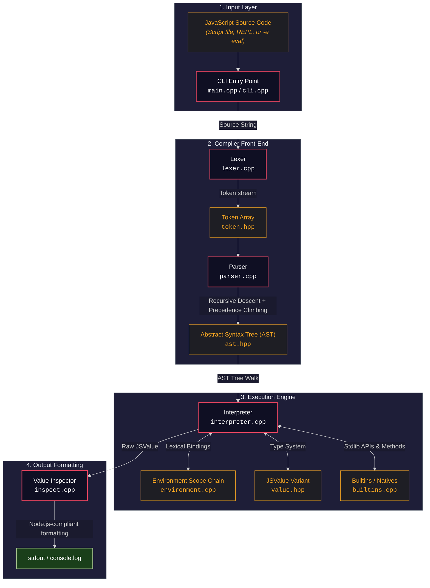
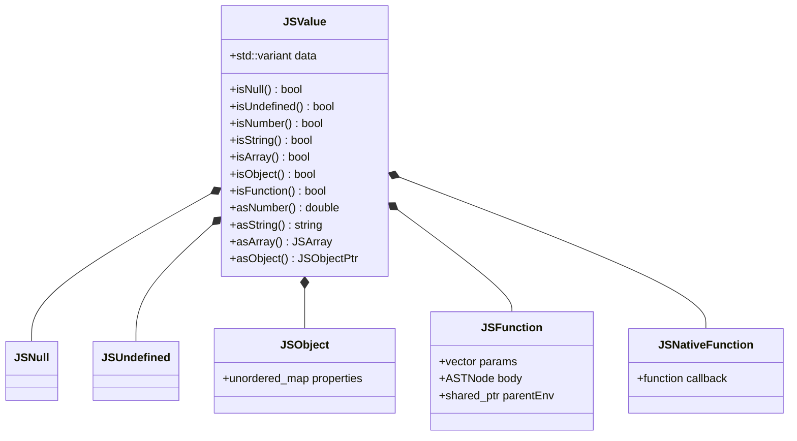
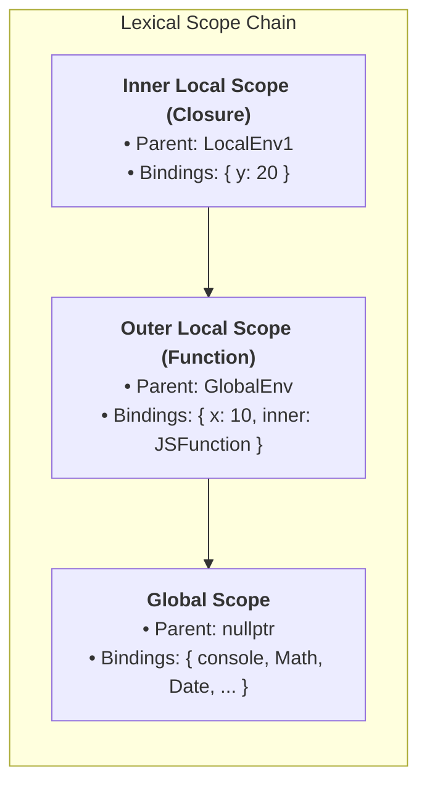

# 🚀 jsling

<p align="center">
  
</p>

<p align="center">
  <strong>A lightweight, from-scratch JavaScript runtime written in C++17</strong><br>
  <em>No V8, no QuickJS, no external engines — built entirely from the ground up for <strong>Thunder Hackathon 2.0</strong>.</em>
</p>

<p align="center">
  <a href="https://en.cppreference.com/w/cpp/compiler_support/17"></a>
  <a href="COMPILER_CPP/tests/hackathon_testcase/"></a>
  <a href="https://github.com/srikant-panda/jsling/releases"></a>
</p>

---

`jsling` lexes, parses, and interprets JavaScript source code using a tree-walking interpreter, supporting a growing subset of ES6+ features. Designed to match Node.js behavior, output formatting, and CLI flags.

---

## ⚡ Quick Start

### 🐧 Linux / macOS

```bash
git clone https://github.com/srikant-panda/jsling.git
cd jsling/COMPILER_CPP
bash scripts/build.sh
```

### 🪟 Windows

Open **Developer Command Prompt for VS 2022+**, then run:

```cmd
git clone https://github.com/srikant-panda/jsling.git
cd jsling\COMPILER_CPP
mkdir build && cd build
cmake .. -G "NMake Makefiles" -DCMAKE_BUILD_TYPE=Release
nmake
```

> [!TIP]
> Alternatively, download the precompiled GUI installer `JSling-Setup.exe` from the [releases page](https://github.com/srikant-panda/jsling/releases) to install system-wide in one click.

---

## 🏃 Run It

```bash
# Run a script file
./build/jsling script.js

# Evaluate an expression directly
./build/jsling -e "console.log(1 + 2)"

# Start the interactive REPL
./build/jsling
```

*On Windows, use `build\jsling.exe` (or `build-windows\jsling.exe`).*

---

## 🧪 Try It Out

Create a file named `demo.js`:

```javascript
// Template literals
let name = "World";
console.log(`Hello, ${name}!`);

// Arrow functions
let double = x => x * 2;
console.log(double(21)); // 42

// Rest & spread
function sum(...nums) {
    let total = 0;
    for (let i = 0; i < nums.length; i++) {
        total = total + nums[i];
    }
    return total;
}
let arr = [1, 2, 3, 4];
console.log(sum(...arr)); // 10

// Array methods
let names = ["Alice", "Bob", "Charlie"];
names.filter(n => n.length > 3).forEach(n => console.log(n));

// Objects
let person = { name: "JSling", version: "1.0.0" };
console.log(`Running ${person.name} v${person.version}`);
```

Run it with:
```bash
./build/jsling demo.js
```

---

## 📐 Architecture & Execution Pipeline

`jsling` uses a classic interpreter design consisting of a Lexer, a Parser (Recursive Descent with Precedence Climbing), an AST representation, and a Tree-Walking Interpreter backed by a Lexical Environment chain.

### 🔄 The Execution Flow



### 🔬 Detailed Pipeline Walkthrough
To understand how code executes in `jsling`, let's trace the variable declaration and binary expression statement:
```javascript
let x = 10 + 5;
```

| Step | Component | File | Representation / Output |
|---|---|---|---|
| **1** | **Lexer** | [lexer.cpp](file:///home/hariomm/Projects/jsling/COMPILER_CPP/src/lexer.cpp) | Generates a sequence of tokens from the raw input string:<br>`LET("let")` → `IDENTIFIER("x")` → `ASSIGN("=")` → `NUMBER("10")` → `PLUS("+")` → `NUMBER("5")` → `SEMICOLON(";")` |
| **2** | **Parser** | [parser.cpp](file:///home/hariomm/Projects/jsling/COMPILER_CPP/src/parser.cpp) | Builds the AST. Parses the addition using **Precedence Climbing** and wraps it in a variable declaration:<br>`VarDecl { id: "x", init: BinaryExpr(op: "+", left: Literal(10), right: Literal(5)) }` |
| **3** | **Interpreter** | [interpreter.cpp](file:///home/hariomm/Projects/jsling/COMPILER_CPP/src/interpreter.cpp) | Evaluates the AST nodes by walking the tree:<br>1. Evaluates the `BinaryExpr`: calls `+` on numbers `10` and `5` using standard C++ float math.<br>2. Produces a `JSValue` of type `double` containing `15.0`. |
| **4** | **Environment** | [environment.cpp](file:///home/hariomm/Projects/jsling/COMPILER_CPP/src/environment.cpp) | Resolves the binding: maps name `"x"` to `JSValue(15.0)` in the local lexical scope context. |

---

### 💾 `JSValue` Type System Architecture

Since JavaScript is dynamically typed, we represent all JavaScript values in C++ using a variant-based tagged union called `JSValue` ([value.hpp](file:///home/hariomm/Projects/jsling/COMPILER_CPP/include/jsling/value.hpp)).



#### Mapping JS Types to C++17 Types
The inner variant handles data storage natively:
* **`null`** ➔ `jsling::JSNull`
* **`undefined`** ➔ `jsling::JSUndefined`
* **`boolean`** ➔ `bool`
* **`number`** ➔ `double`
* **`string`** ➔ `std::string`
* **`Array`** ➔ `std::vector<JSValue>` (aliased as `JSArray`)
* **`Object`** ➔ `std::shared_ptr<JSObject>`
* **`Function`** ➔ `std::shared_ptr<JSFunction>`
* **`Native Function`** ➔ `std::shared_ptr<JSNativeFunction>`

---

### 🌐 Scope & Environment Resolution

Scoping in `jsling` is lexical. Functions capture the environment in which they are defined, enabling closures. The scope resolution forms a linked chain of environments ([environment.hpp](file:///home/hariomm/Projects/jsling/COMPILER_CPP/include/jsling/environment.hpp)):


When looking up a variable:
1. Check current scope.
2. If not found, traverse up the parent link until reaching the **Global Scope**.
3. If still not found, throw a `ReferenceError` exception via [errors.hpp](file:///home/hariomm/Projects/jsling/COMPILER_CPP/include/jsling/errors.hpp).

---

## ✨ Key Features & Language Support

`jsling` provides robust support for a substantial subset of ES6+ syntax and built-in prototypes:

### 🧩 Language Constructs

| Category | Supported Features & Syntax |
|---|---|
| **Variables & Binding** | `let` & `const` (block-scoped), `var` (function-scoped), with comma-separated declarations (e.g., `let a = 1, b = 2`) |
| **Functions** | First-class functions, closures, recursion, lexical scope, arrow functions (`x => x * 2`), and default parameters |
| **Parameters & Spread** | Rest parameters (`function f(...args)`), spread arguments (`f(...arr)`), array/object spread (`[...a, ...b]`, `{...obj, z: 3}`) |
| **Control Flow** | `if-else`, loops (`for`, `while`, `do-while`), `switch-case`, control flow statements (`break`, `continue`, `return`) |
| **Operators** | Logical (`&&`, `||`, `!`), comparison (`==`, `===`, `!=`, `!==`, `<`, `>`, `<=`, `>=`), bitwise (`&`, `\|`, `^`, `<<`, `>>`, `>>>`), postfix/prefix (`++`, `--`), and ternary (`? :`) |
| **Template Strings** | Full template literals (`` `Hello ${name}!` ``) with support for nested evaluation |

### 📦 Standard Library & Built-ins

| Namespace / Class | Supported Methods |
|---|---|
| 🎛️ **Globals & I/O** | `console.log`, `parseInt`, `parseFloat`, `Date` |
| 🧮 **Math** | All core properties & methods: `Math.floor`, `Math.ceil`, `Math.random`, `Math.abs`, `Math.pow`, `Math.sqrt`, `Math.sin`, `Math.cos`, etc. |
| 🗂️ **Array** | `.map()`, `.filter()`, `.reduce()`, `.forEach()`, `.find()`, `.some()`, `.every()`, `.sort()`, `.splice()`, `.slice()`, `.join()`, `.includes()`, `.indexOf()`, `.push()`, `.pop()`, `.shift()`, `.unshift()`, `.reverse()`, `.concat()` |
| 🔤 **String** | `.split()`, `.slice()`, `.includes()`, `.indexOf()`, `.replace()`, `.replaceAll()`, `.trim()`, `.toUpperCase()`, `.toLowerCase()`, `.startsWith()`, `.endsWith()`, `.repeat()`, `.padStart()`, `.padEnd()`, `.charAt()`, `.substring()`, `.concat()` |
| 🔢 **Number** | `.toFixed()`, `.toString(radix)` |
| 🗃️ **Object** | `Object.keys()`, `Object.values()`, `Object.entries()`, `Object.assign()`, `Object.freeze()` |

---

## 🏆 Hackathon Evaluation Test Cases

**5 test cases × 20 points = 100 points total**

Run the official hackathon evaluation test suite with full verbose output (source code, actual vs expected, pass/fail per test):

```bash
cd COMPILER_CPP
bash scripts/run-hackathon-testcase.sh
```

### Test Case Overview

| TC | Test Case | JS Concepts Tested | Points | Status |
|----|-----------|-------------------|--------|--------|
| TC-1 | Odd / Even Checker | `if/else`, modulo `%`, string concat `+` | 20 | ✅ Pass |
| TC-2 | Triangle Pattern | Nested `for` loops, string `+=`, `console.log` | 20 | ✅ Pass |
| TC-3 | Armstrong Number | `while` loop, `**` exponent, `Math.floor`, functions | 20 | ✅ Pass |
| TC-4 | Array Reverse | Spread `[...arr]`, `.reverse()`, `.join(", ")` | 20 | ✅ Pass |
| TC-5 | String Palindrome | `.split("")`, `.reverse()`, `.join("")`, `===` | 20 | ✅ Pass |

### 📋 Test Case Specifications

<details>
<summary>🔍 <b>TC-1: Odd / Even Checker</b> (20 Points)</summary>

```javascript
let num = 7;
if (num % 2 === 0) {
    console.log(num + " is Even");
} else {
    console.log(num + " is Odd");
}
// Expected Output: 7 is Odd
```
</details>

<details>
<summary>🔍 <b>TC-2: Triangle Pattern</b> (20 Points)</summary>

```javascript
for (let i = 1; i <= 5; i++) {
    let row = "";
    for (let j = 1; j <= i; j++) {
        row += "*";
    }
    console.log(row);
}
// Expected Output:
// *
// **
// ***
// ****
// *****
```
</details>

<details>
<summary>🔍 <b>TC-3: Armstrong Number Checker</b> (20 Points)</summary>

```javascript
function isArmstrong(num) {
    let temp = num;
    let sum = 0;
    while (temp > 0) {
        let digit = temp % 10;
        sum += digit ** 3;
        temp = Math.floor(temp / 10);
    }
    return sum === num;
}
console.log(isArmstrong(153));  // Expected: true
console.log(isArmstrong(123));  // Expected: false
```
</details>

<details>
<summary>🔍 <b>TC-4: Array Reverse via Spread</b> (20 Points)</summary>

```javascript
let arr = [1, 2, 3, 4, 5];
let reversed = [...arr].reverse();
console.log("Original: " + arr.join(", "));
console.log("Reversed: " + reversed.join(", "));
// Expected Output:
// Original: 1, 2, 3, 4, 5
// Reversed: 5, 4, 3, 2, 1
```
</details>

<details>
<summary>🔍 <b>TC-5: String Palindrome Check</b> (20 Points)</summary>

```javascript
let str = "racecar";
let reversed = str.split("").reverse().join("");
if (str === reversed) {
    console.log(str + " is a Palindrome");
} else {
    console.log(str + " is not a Palindrome");
}
// Expected Output: racecar is a Palindrome
```
</details>

---

### 📂 Test File Structure

```
COMPILER_CPP/tests/hackathon_testcase/
├── tc1_odd_even.js       + tc1_odd_even.expected
├── tc2_triangle.js       + tc2_triangle.expected
├── tc3_armstrong.js      + tc3_armstrong.expected
├── tc4_array_reverse.js  + tc4_array_reverse.expected
└── tc5_palindrome.js     + tc5_palindrome.expected
```

### 🏆 Full Test Suite

```bash
cd COMPILER_CPP
bash scripts/run-tests.sh
```

This script executes all `.js` files in `tests/` and automatically compares their terminal outputs against `.expected` files.

---

## ⚙️ System Installation

### 🐧 Linux / macOS
```bash
cd COMPILER_CPP
bash scripts/install-local.sh    # Installs executable to /usr/local/bin or ~/.local/bin
```

### 🪟 Windows
To build and package a native Windows executable installer:
```cmd
build-installer.bat
```
This generates the GUI setup wizard in `dist\JSling-Setup.exe` using Inno Setup.

For detailed setup walkthroughs and troubleshooting, see [INSTALL.md](file:///home/hariomm/Projects/jsling/INSTALL.md).

---

## 📂 Project Structure & Navigation

Below is a detailed map of the project files. Every file and folder name is a clickable link to let you explore the source code directly:

* 📄 [README.md](file:///home/hariomm/Projects/jsling/README.md) — Main landing page & architecture overview
* 📖 [INSTALL.md](file:///home/hariomm/Projects/jsling/INSTALL.md) — Detailed installation & build instructions
* 📝 [CPP_IMPLEMENTATION.md](file:///home/hariomm/Projects/jsling/CPP_IMPLEMENTATION.md) — Detailed implementation blueprint & status checklist
* 🛠️ [build-installer.bat](file:///home/hariomm/Projects/jsling/build-installer.bat) — Automated batch script to package Windows binary
* 📦 [jsling.iss](file:///home/hariomm/Projects/jsling/jsling.iss) — Windows installer installer generator script
* 🎨 [assets/](file:///home/hariomm/Projects/jsling/assets) — Workspace icons, branding assets, and preview screenshots
  * 🖼️ [jsling-preview.png](file:///home/hariomm/Projects/jsling/assets/jsling-preview.png) — Preview screen capture
  * 🎨 [jsling.svg](file:///home/hariomm/Projects/jsling/assets/jsling.svg) — Vector logo designed for the project
* 💻 [COMPILER_CPP/](file:///home/hariomm/Projects/jsling/COMPILER_CPP) — Core C++17 runtime source directory
  * ⚙️ [CMakeLists.txt](file:///home/hariomm/Projects/jsling/COMPILER_CPP/CMakeLists.txt) — CMake configuration file
  * 📂 [include/jsling/](file:///home/hariomm/Projects/jsling/COMPILER_CPP/include/jsling) — Core C++ Header Files
    * 🔑 [token.hpp](file:///home/hariomm/Projects/jsling/COMPILER_CPP/include/jsling/token.hpp) — Token type and structure definitions
    * 🔍 [lexer.hpp](file:///home/hariomm/Projects/jsling/COMPILER_CPP/include/jsling/lexer.hpp) — Lexical analyzer declarations
    * 🗂️ [ast.hpp](file:///home/hariomm/Projects/jsling/COMPILER_CPP/include/jsling/ast.hpp) — Abstract Syntax Tree node structs
    * 📈 [parser.hpp](file:///home/hariomm/Projects/jsling/COMPILER_CPP/include/jsling/parser.hpp) — Recursive descent parser declarations
    * 🌐 [environment.hpp](file:///home/hariomm/Projects/jsling/COMPILER_CPP/include/jsling/environment.hpp) — Scope mapping and parent links
    * 💎 [value.hpp](file:///home/hariomm/Projects/jsling/COMPILER_CPP/include/jsling/value.hpp) — Tagged union `JSValue` definition
    * 📚 [builtins.hpp](file:///home/hariomm/Projects/jsling/COMPILER_CPP/include/jsling/builtins.hpp) — Prototypes for built-in JavaScript functions
    * ⚙️ [interpreter.hpp](file:///home/hariomm/Projects/jsling/COMPILER_CPP/include/jsling/interpreter.hpp) — Evaluation visitor engine declarations
    * ⚠️ [errors.hpp](file:///home/hariomm/Projects/jsling/COMPILER_CPP/include/jsling/errors.hpp) — Internal signal & error representation
    * 🔎 [inspect.hpp](file:///home/hariomm/Projects/jsling/COMPILER_CPP/include/jsling/inspect.hpp) — Node.js-compatible value formatter declarations
    * 🖥️ [cli.hpp](file:///home/hariomm/Projects/jsling/COMPILER_CPP/include/jsling/cli.hpp) — Shell terminal, REPL, and argument runner
  * 📂 [src/](file:///home/hariomm/Projects/jsling/COMPILER_CPP/src) — C++ Source Implementation Files
    * 🚀 [main.cpp](file:///home/hariomm/Projects/jsling/COMPILER_CPP/src/main.cpp) — Application entry point
    * 🔑 [token.cpp](file:///home/hariomm/Projects/jsling/COMPILER_CPP/src/token.cpp) — Token string conversions
    * 🔍 [lexer.cpp](file:///home/hariomm/Projects/jsling/COMPILER_CPP/src/lexer.cpp) — JavaScript character-by-character scanner logic
    * 🗂️ [ast.cpp](file:///home/hariomm/Projects/jsling/COMPILER_CPP/src/ast.cpp) — Syntax tree node implementations
    * 📈 [parser.cpp](file:///home/hariomm/Projects/jsling/COMPILER_CPP/src/parser.cpp) — Operator precedence climber & expression parsing logic
    * 🌐 [environment.cpp](file:///home/hariomm/Projects/jsling/COMPILER_CPP/src/environment.cpp) — Variable lookup and block-scope initialization
    * 💎 [value.cpp](file:///home/hariomm/Projects/jsling/COMPILER_CPP/src/value.cpp) — `JSValue` helper methods and dynamic conversions
    * 📚 [builtins.cpp](file:///home/hariomm/Projects/jsling/COMPILER_CPP/src/builtins.cpp) — Implementations of standard library methods (e.g. array, object, string methods)
    * ⚙️ [interpreter.cpp](file:///home/hariomm/Projects/jsling/COMPILER_CPP/src/interpreter.cpp) — AST evaluation and control-flow engine
    * ⚠️ [errors.cpp](file:///home/hariomm/Projects/jsling/COMPILER_CPP/src/errors.cpp) — Error stack formatting
    * 🔎 [inspect.cpp](file:///home/hariomm/Projects/jsling/COMPILER_CPP/src/inspect.cpp) — Formatter for array formatting, spacing, and quotes
    * 🖥️ [cli.cpp](file:///home/hariomm/Projects/jsling/COMPILER_CPP/src/cli.cpp) — Interactive REPL and file execution runner
  * 📂 [scripts/](file:///home/hariomm/Projects/jsling/COMPILER_CPP/scripts) — Build & Automation Scripts
    * 🔨 [build.sh](file:///home/hariomm/Projects/jsling/COMPILER_CPP/scripts/build.sh) — Easy compiler builder script
    * 📥 [install-local.sh](file:///home/hariomm/Projects/jsling/COMPILER_CPP/scripts/install-local.sh) — User bin local installer script
    * 📝 [run-tests.sh](file:///home/hariomm/Projects/jsling/COMPILER_CPP/scripts/run-tests.sh) — Full validation tests runner
    * 🏆 [run-hackathon-testcase.sh](file:///home/hariomm/Projects/jsling/COMPILER_CPP/scripts/run-hackathon-testcase.sh) — Official hackathon evaluation runner

---

## 📈 Status

The core interpreter is **complete and fully operational** (Phases 1–4). Advanced ES6+ features like arrow functions, template literals, rest/spread parameters, and the `in` operator are fully supported. 

Planned roadmap features include destructuring assignment, `try/catch` exception blocks, classes, `for...of` statements, and full prototype chains.

For the detailed status of every single language construct, please review [CPP_IMPLEMENTATION.md](file:///home/hariomm/Projects/jsling/CPP_IMPLEMENTATION.md).

---

*Built for Thunder Hackathon 2.0 — June 2026*
