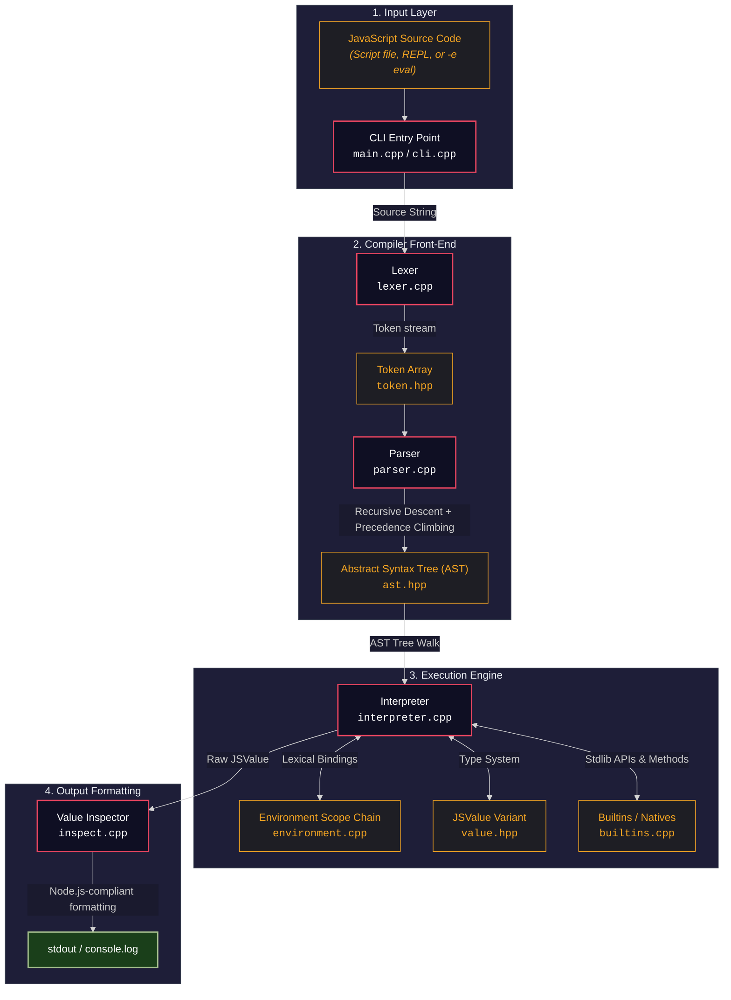
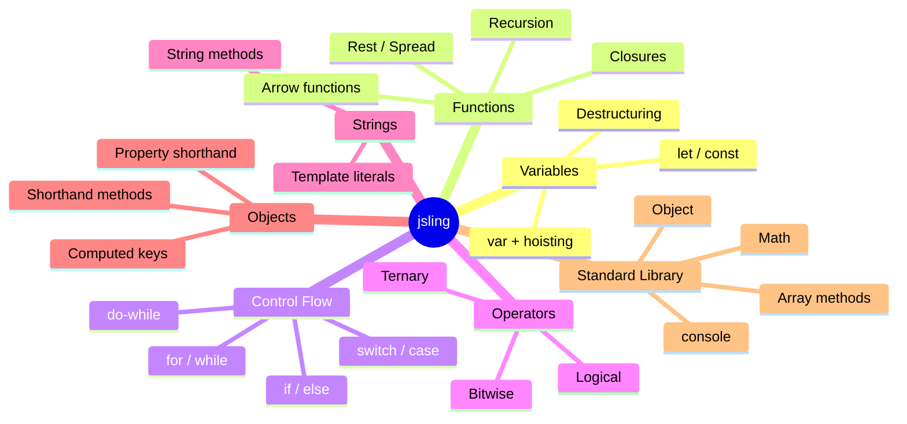

# jsling

<p align="center">
  
</p>

<p align="center">
  <strong>A lightweight, from-scratch JavaScript runtime written in C++17</strong><br>
  <em>No V8, no QuickJS, no external engines — built entirely from the ground up for <strong>Thunder Hackathon 2.0</strong>.</em>
</p>

<p align="center">
  <a href="https://en.cppreference.com/w/cpp/compiler_support/17"></a>
  <a href="COMPILER_CPP/tests/hackathon_testcase/"></a>
  <a href="https://jsling-website-five.vercel.app/#downloads"></a>
</p>

---

`jsling` lexes, parses, and interprets JavaScript source code using a tree-walking interpreter, supporting a wide subset of ES6+ features. Designed to match Node.js behavior, output formatting, CLI flags, interactive REPL, and diagnostic error reporting.

## Table of Contents

- [For Hackathon Judges](#for-hackathon-judges)
- [Quick Start](#quick-start)
  - [Build](#build)
  - [Run](#run)
  - [Try It Out](#try-it-out)
- [Key Features](#key-features)
- [Installation](#installation)
- [Architecture](#architecture)
- [Testing](#testing)
- [Project Structure](#project-structure)
- [Known Limitations & Issues](#known-limitations--issues)
- [Status](#status)

---

## For Hackathon Judges

> **Windows only** — The pre-built `bin\jsling.exe` and `run.bat` launcher target Windows. For Linux/macOS, see [Quick Start](#quick-start) to build from source.

**Zero setup required.** The pre-built binary is shipped at `bin\jsling.exe`. No build tools, no MinGW, no Visual Studio needed.

### Running any JavaScript file

```cmd
bin\jsling.exe your_testcase.js
```

Output is printed to stdout, matching Node.js `console.log` formatting.

### Interactive Menu

Double-click `run.bat` at the project root for a menu with demo script, hackathon tests, full test suite, REPL, and inline eval.

### Official Hackathon Test Suite

```cmd
COMPILER_CPP\scripts\run-hackathon-testcase.bat
```

Runs 5 test cases (20 pts each = 100 pts total) with verbose output showing source code, actual vs expected, and pass/fail status.

| TC | Test Case | JS Concepts Tested | Points | Status |
|----|-----------|-------------------|--------|--------|
| TC-1 | Odd / Even Checker | `if/else`, modulo `%`, string concat `+` | 20 | Pass |
| TC-2 | Triangle Pattern | Nested `for` loops, string `+=`, `console.log` | 20 | Pass |
| TC-3 | Armstrong Number | `while` loop, `**` exponent, `Math.floor`, functions | 20 | Pass |
| TC-4 | Array Reverse | Spread `[...arr]`, `.reverse()`, `.join(", ")` | 20 | Pass |
| TC-5 | String Palindrome | `.split("")`, `.reverse()`, `.join("")`, `===` | 20 | Pass |

Test files are in [COMPILER_CPP/tests/hackathon_testcase/](COMPILER_CPP/tests/hackathon_testcase/).

---

## Quick Start

### Build

**Linux / macOS:**
```bash
git clone https://github.com/srikant-panda/jsling.git
cd jsling/COMPILER_CPP
bash scripts/build.sh
```

**Prerequisites:**
| Tool | Minimum Version | Notes |
|------|-----------------|-------|
| `gcc` / `g++` | **7.0+** | Required for C++17 `<variant>` header support |
| `cmake` | **3.10+** | For C++17 project configuration |
| `make` | **4.0+** | GNU Make (standard on Linux/macOS) |

---

**Windows (MinGW):**
```cmd
git clone https://github.com/srikant-panda/jsling.git
cd jsling\COMPILER_CPP
scripts\build.bat
```

**Prerequisites:**
| Tool | Minimum Version | Notes |
|------|-----------------|-------|
| [MinGW-w64](https://www.mingw-w64.org/) | **GCC 7.0+** | Includes `gcc`, `g++`, and `mingw32-make` |
| [CMake](https://cmake.org/download/) | **3.10+** | Must be on PATH |

> **Important:** MinGW distributions with GCC < 7 (e.g., older MinGW.org releases) will fail with `fatal error: variant: No such file or directory`. Use [MSYS2](https://www.msys2.org/) or a recent MinGW-w64 build.

No Visual Studio or Developer Command Prompt needed — `build.bat` auto-detects MinGW.

---

**Windows (Visual Studio):**
Open Developer Command Prompt for VS 2019+:
```cmd
cd jsling\COMPILER_CPP
mkdir build && cd build
cmake .. -G "NMake Makefiles" -DCMAKE_BUILD_TYPE=Release
nmake
```

**Prerequisites:**
| Tool | Minimum Version | Notes |
|------|-----------------|-------|
| Visual Studio Build Tools | **2019+** | With "Desktop development with C++" workload |
| [CMake](https://cmake.org/download/) | **3.10+** | Included with VS Build Tools |

> **Note:** NMake Makefiles generator requires the Developer Command Prompt. Regular CMD/PowerShell will fail with `nmake: command not found`.

> **Tip:** Download the precompiled GUI installer from [jsling-website-five.vercel.app/#downloads](https://jsling-website-five.vercel.app/#downloads) for one-click system-wide install.

### Run

**Linux / macOS:**
```bash
./build/jsling script.js              # Run a script
./build/jsling -e "console.log(42)"   # Evaluate expression
./build/jsling                        # Start REPL
```

**Windows:**
```cmd
build\jsling.exe script.js            # Run a script
build\jsling.exe -e "console.log(42)" # Evaluate expression
build\jsling.exe                      # Start REPL
```

### Try It Out

Create a `demo.js`:

```javascript
// Template literals
let name = "World";
console.log(`Hello, ${name}!`);

// Arrow functions
let double = x => x * 2;
console.log(double(21)); // 42

// Rest & spread
function sum(...nums) {
    let total = 0;
    for (let i = 0; i < nums.length; i++) {
        total = total + nums[i];
    }
    return total;
}
let arr = [1, 2, 3, 4];
console.log(sum(...arr)); // 10

// Array methods
let names = ["Alice", "Bob", "Charlie"];
names.filter(n => n.length > 3).forEach(n => console.log(n));

// Objects
let person = { name: "JSling", version: "1.0.0" };
console.log(`Running ${person.name} v${person.version}`);
```

Run it:
```bash
./build/jsling demo.js        # Linux/macOS
build\jsling.exe demo.js      # Windows
```

---

## Key Features

### Language Constructs

| Category | Supported Features |
|---|---|
| **Variables** | `let` & `const` (block-scoped), `var` (function-scoped with hoisting), destructuring with rest/default |
| **Functions** | First-class, closures, recursion, arrow functions (`x => x * 2`), default parameters, named function expressions |
| **Parameters** | Rest (`...args`), spread (`f(...arr)`), parameter destructuring |
| **Control Flow** | `if/else`, `for`, `while`, `do-while`, `switch-case`, `break`, `continue`, `return` |
| **Operators** | Logical, comparison, bitwise, postfix/prefix (`++`, `--`), ternary (`?:`) |
| **Template Strings** | Full template literals with nested evaluation |
| **Objects** | Property shorthand, computed keys, shorthand methods |

### Standard Library

| Namespace | Methods |
|---|---|
| **Globals** | `console.log`, `parseInt`, `parseFloat`, `Date` |
| **Math** | `floor`, `ceil`, `random`, `abs`, `pow`, `sqrt`, `sin`, `cos`, and more |
| **Array** | `map`, `filter`, `reduce`, `forEach`, `find`, `some`, `every`, `sort`, `splice`, `slice`, `join`, `includes`, `indexOf`, `push`, `pop`, `shift`, `unshift`, `reverse`, `concat` |
| **String** | `split`, `slice`, `includes`, `indexOf`, `replace`, `replaceAll`, `trim`, `toUpperCase`, `toLowerCase`, `startsWith`, `endsWith`, `repeat`, `padStart`, `padEnd`, `charAt`, `substring`, `concat` |
| **Number** | `toFixed`, `toString(radix)` |
| **Object** | `keys`, `values`, `entries`, `assign`, `freeze` |

### REPL & Diagnostics

| Feature | Description |
|---|---|
| **Multiline REPL** | Automatically defers execution until all `{`, `(`, `[` are matched |
| **Node.js-style** | Prints non-`undefined` expression results |
| **Colorized output** | ANSI-colored arrays, objects, functions, dates, and primitives |
| **Error tracebacks** | `TypeError`, `ReferenceError`, `SyntaxError`, `RangeError` with caret source lines |
| **Typo suggestions** | "Did you mean '...'?" using Levenshtein distance |

---

## Installation

For quick setup, see [Quick Start](#quick-start) above. For full details, see [INSTALL.md](INSTALL.md).

**Linux / macOS:**
```bash
cd COMPILER_CPP
bash scripts/install-local.sh    # Installs to /usr/local/bin or ~/.local/bin
```

**Windows:**
Add `COMPILER_CPP\build` to your system PATH, or download the GUI installer from [jsling-website-five.vercel.app/#downloads](https://jsling-website-five.vercel.app/#downloads).

---

## Architecture

`jsling` uses a classic interpreter design: Lexer, Parser (Recursive Descent with Precedence Climbing), AST, and Tree-Walking Interpreter backed by a Lexical Environment chain.



### JSValue Type System

All JavaScript values are represented in C++17 as a `std::variant` tagged union ([value.hpp](COMPILER_CPP/include/jsling/value.hpp)):

```mermaid
classDiagram
    class JSValue {
        +std::variant data
        +isNull() bool
        +isUndefined() bool
        +isNumber() bool
        +isString() bool
        +isArray() bool
        +isObject() bool
        +isFunction() bool
    }
    class JSNull
    class JSUndefined
    class JSObject {
        +unordered_map properties
    }
    class JSFunction {
        +vector params
        +ASTNode body
        +shared_ptr parentEnv
    }
    class JSNativeFunction {
        +function callback
    }

    JSValue *-- JSNull : null
    JSValue *-- JSUndefined : undefined
    JSValue *-- "bool" : boolean
    JSValue *-- "double" : number
    JSValue *-- "string" : string
    JSValue *-- JSObject : Object
    JSValue *-- JSFunction : Function
    JSValue *-- JSNativeFunction : Native
```

### Scope Resolution

Functions capture the environment where they are defined. Variable lookup traverses parent scopes until found:


### Feature Coverage



---

## Testing

### Hackathon Evaluation Suite

5 test cases x 20 points = 100 points total. Verbose output shows source code, actual vs expected, and pass/fail per test.

**Linux / macOS:**
```bash
cd COMPILER_CPP
bash scripts/run-hackathon-testcase.sh
```

**Windows:**
```cmd
cd COMPILER_CPP
scripts\run-hackathon-testcase.bat
```

### Full Test Suite

Runs all `.js` files in `tests/` and compares output against `.expected` files.

**Linux / macOS:**
```bash
cd COMPILER_CPP
bash scripts/run-tests.sh
```

**Windows:**
```cmd
cd COMPILER_CPP
scripts\run-tests.bat
scripts\run-tests.bat --filter basics    # run only matching tests
```

Both runners auto-build if the binary is not found.

### Test File Structure

```
COMPILER_CPP/tests/
├── hackathon_testcase/         # 5 official evaluation tests
│   ├── tc1_odd_even.js         + .expected
│   ├── tc2_triangle.js         + .expected
│   ├── tc3_armstrong.js        + .expected
│   ├── tc4_array_reverse.js    + .expected
│   └── tc5_palindrome.js       + .expected
├── test_basics.js              # Variables, types, operators
├── test_functions.js           # Closures, HOF, recursion
├── test_arrays.js              # Array methods
├── test_strings.js             # String methods
├── test_objects.js             # Object operations
├── test_control.js             # Loops, conditionals
├── test_builtins.js            # Math, console, globals
├── test_float.js               # Floating-point edge cases
├── test_arrow_spread_rest.js   # Arrow functions, spread/rest
└── test1_closures_hof.js       # Advanced closures & HOF
```

---

## Project Structure

* [run.bat](run.bat) — One-click launcher for Windows (judges: double-click this)
* [bin/](bin) — Pre-built `jsling.exe` (shipped, no build needed)
* [INSTALL.md](INSTALL.md) — Detailed installation & build instructions
* [CPP_IMPLEMENTATION.md](CPP_IMPLEMENTATION.md) — Implementation blueprint & status
* [assets/](assets) — Icons, branding, and screenshots
* [COMPILER_CPP/](COMPILER_CPP) — Core C++17 runtime
  * [CMakeLists.txt](COMPILER_CPP/CMakeLists.txt) — CMake configuration
  * [include/jsling/](COMPILER_CPP/include/jsling) — Header files
    * [token.hpp](COMPILER_CPP/include/jsling/token.hpp) — Token types
    * [lexer.hpp](COMPILER_CPP/include/jsling/lexer.hpp) — Lexer declarations
    * [ast.hpp](COMPILER_CPP/include/jsling/ast.hpp) — AST node structs
    * [parser.hpp](COMPILER_CPP/include/jsling/parser.hpp) — Parser declarations
    * [environment.hpp](COMPILER_CPP/include/jsling/environment.hpp) — Scope chain
    * [value.hpp](COMPILER_CPP/include/jsling/value.hpp) — JSValue tagged union
    * [builtins.hpp](COMPILER_CPP/include/jsling/builtins.hpp) — Built-in prototypes
    * [interpreter.hpp](COMPILER_CPP/include/jsling/interpreter.hpp) — Interpreter declarations
    * [errors.hpp](COMPILER_CPP/include/jsling/errors.hpp) — Error types
    * [inspect.hpp](COMPILER_CPP/include/jsling/inspect.hpp) — Value formatter
    * [cli.hpp](COMPILER_CPP/include/jsling/cli.hpp) — REPL and CLI
  * [src/](COMPILER_CPP/src) — Source implementation
    * [main.cpp](COMPILER_CPP/src/main.cpp) — Entry point
    * [lexer.cpp](COMPILER_CPP/src/lexer.cpp) — Tokenizer
    * [parser.cpp](COMPILER_CPP/src/parser.cpp) — Recursive descent parser
    * [ast.cpp](COMPILER_CPP/src/ast.cpp) — AST node implementation
    * [interpreter.cpp](COMPILER_CPP/src/interpreter.cpp) — Tree-walking evaluator
    * [environment.cpp](COMPILER_CPP/src/environment.cpp) — Scope resolution
    * [value.cpp](COMPILER_CPP/src/value.cpp) — JSValue conversions
    * [builtins.cpp](COMPILER_CPP/src/builtins.cpp) — Standard library methods
    * [errors.cpp](COMPILER_CPP/src/errors.cpp) — Error formatting
    * [inspect.cpp](COMPILER_CPP/src/inspect.cpp) — Output formatter
    * [cli.cpp](COMPILER_CPP/src/cli.cpp) — REPL runner
  * [scripts/](COMPILER_CPP/scripts) — Build & test automation
    * [build.sh](COMPILER_CPP/scripts/build.sh) / [build.bat](COMPILER_CPP/scripts/build.bat) — Build scripts
    * [run-tests.sh](COMPILER_CPP/scripts/run-tests.sh) / [run-tests.bat](COMPILER_CPP/scripts/run-tests.bat) — Full test runner
    * [run-hackathon-testcase.sh](COMPILER_CPP/scripts/run-hackathon-testcase.sh) / [run-hackathon-testcase.bat](COMPILER_CPP/scripts/run-hackathon-testcase.bat) — Hackathon runner

---

## Known Limitations & Issues

jsling is a from-scratch JavaScript runtime built for Thunder Hackathon 2.0. It implements a substantial subset of ES6+, but intentionally omits several advanced features. This section documents what the project **cannot** do and known current issues.

### Unsupported Language Features

The following JavaScript constructs are **not yet implemented** and will produce `SyntaxError` or runtime errors:

| Category | Unsupported Features |
|----------|----------------------|
| **Exception Handling** | `try`, `catch`, `finally`, `throw` statements |
| **Classes** | `class` declarations, `extends` inheritance, `super()`, static methods, getters/setters |
| **Iteration** | `for...of` (iterables), `for...in` (enumerables) |
| **Async** | `async`/`await`, `Promise`, `setTimeout`, `setInterval` |
| **Modules** | `import`, `export`, ES modules |
| **Advanced Types** | `Symbol`, `Map`, `Set`, `WeakMap`, `WeakSet`, `Proxy`, `Reflect` |
| **Generators** | `function*`, `yield`, generator protocols |
| **Regular Expressions** | `RegExp` literals, `.match()`, `.test()`, `.replace()` with regex |
| **Other** | `eval()`, `with` statement, tagged template literals, decorators |

### Partial or Incomplete Implementations

| Feature | Current Status | Limitation |
|---------|----------------|------------|
| **Prototype Chains** | Basic `__proto__` link exists | Full prototype delegation and `instanceof` not complete |
| **Destructuring** | Array/object destructuring works | Nested destructuring edge cases may fail |
| **Template Literals** | `${expression}` interpolation works | Tagged templates not supported |
| **Computed Properties** | `{[expr]: value}` works | Computed method names in classes not supported (classes not implemented) |

### Known Bugs & Edge Cases

| Issue | Description | Severity |
|-------|-------------|----------|
| **Floating-point precision** | Some edge cases may differ from Node.js (e.g., `0.1 + 0.2` display) | Low |
| **Windows MinGW GCC < 7** | Older MinGW distributions fail with `fatal error: variant: No such file or directory` | Medium — use MSYS2 or MinGW-w64 with GCC 7+ |
| **NMake environment** | `cmake -G "NMake Makefiles"` requires Developer Command Prompt; regular CMD/PowerShell fails with `nmake: command not found` | Medium — use MinGW build instead |
| **CRLF line endings** | Windows `.bat` test runners previously had comparison issues (now fixed with PowerShell normalization) | Fixed |
| **Deeply nested closures** | Extremely deep closure chains (>1000 levels) may cause stack overflow | Low |

### What This Project Is NOT

- **Not a replacement for Node.js** — jsling is a learning/hackathon project, not production-ready
- **Not V8/QuickJS** — no JIT compilation, no bytecode, pure tree-walking interpreter (slower)
- **Not ES6-compliant** — implements a subset, not the full ECMAScript specification
- **Not async-capable** — no event loop, no promises, no `async`/`await`

### Test Skips

Two tests in the full suite are intentionally skipped:

| Test File | Skip Reason |
|-----------|-------------|
| `test2_destructuring_spread.js` | Advanced destructuring, template expressions, computed properties pending |
| `test4_classes_errors.js` | Class syntax not yet implemented |

---

## Status

The core interpreter is **complete and fully operational**. Supported: arrow functions, template literals, rest/spread, destructuring, object shorthand/computed properties, var hoisting, named function expressions, and the `in` operator.

The REPL supports multiline balanced inputs, ANSI-colored inspection, caret traceback, and spellcheck suggestions.

**Planned:** `try/catch`, classes, `for...of`/`for...in`, full prototype chains.

See [CPP_IMPLEMENTATION.md](CPP_IMPLEMENTATION.md) for the detailed feature status of every language construct.

---

*Built for Thunder Hackathon 2.0 — June 2026*
